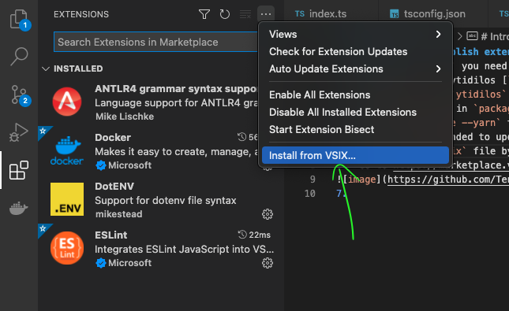
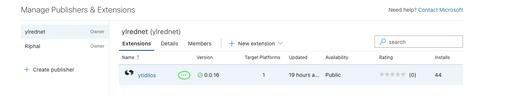

# Instruction how to publish extension

To publish `hardhat-solidity` you need to do next steps:

1.  Checkout out `main`
2.  Run a full check, stopping on failure: `yarn fullcheck`
3.  Update the package version and changelog with changeset: `yarn changeset version`
4.  Check the version and changelog make sense (for the moment the changelog will need to be manually cleaned up as changeset is not adding in the _Keep a Changelog_ format).
5.  Git tag and push with: `yarn changeset tag && git push --follow-tags`
6.  Run the package command to generate the `vsix` file in the project root: `yarn package`
7.  We can test `.vsix` file by installing it manually in VSCode.\
    
8.  Go to https://marketplace.visualstudio.com/manage/publishers/nomicfoundation and click on 3 dots.\
    
9.  Click on `Update` and find `.vsix` you want to release and click on `Upload`, and that's it, the new version was published. 🎉🎉🎉
